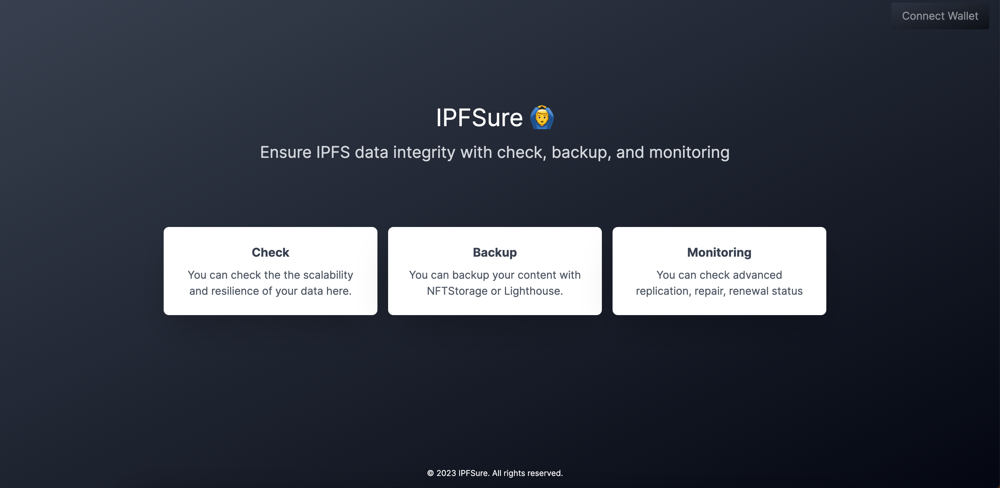
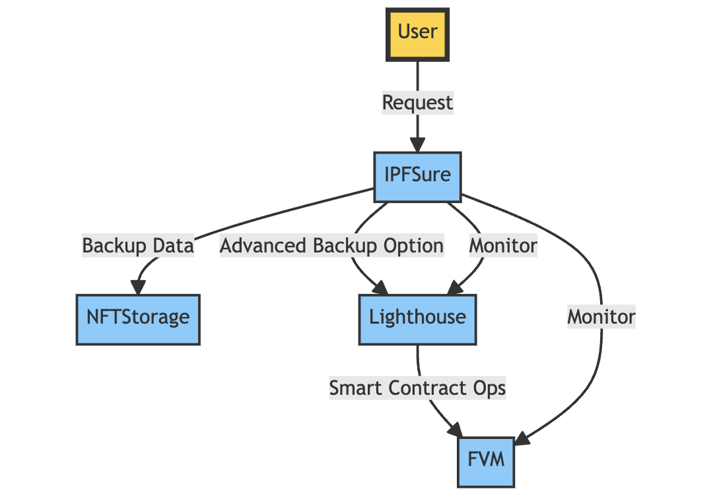

# IPFSure 🙆‍♂️

Ensure IPFS data integrity with check, backup, and monitoring.

## Problem

Currently, IPFS data requires more storage providers to support the data. However, its visibility remains limited for the majority of users.

## Solution

IPFSure offers functionality to ensure the integrity of IPFS data through its check, backup, and monitoring features:

- **Check:** Examine the data's scalability and resilience using IPFS & Filecoin data indexers.
- **Backup:** We offer a straightforward backup through NFTStorage for casual users. For advanced users, we offer customizable backup options via Lighthouse. When users opt for Lighthouse backup, they can also choose functionalities like replication, repair, and renewal powered by FVM smart contracts.
- **Monitoring:** Provides an interface for users to check the job status of the FVM smart contract and its batch processes.

## Benefits

IPFSure emphasizes user control and data ownership. Unlike conventional backup solutions that store your data on their servers, IPFSure empowers users by backing up data within their controlled spaces. Specifically:

- **User Control:** IPFSure doesn't back up data for users. Instead, it requests users to provide API keys for NFTStorage and Lighthouse. The data is then stored within the user's dedicated storage, ensuring that they maintain full ownership and control over their data.
- **Automation:** For users who prioritize data control, IPFSure serves as an automated tool to facilitate data backup while ensuring that the control remains in the hands of the user.

- **Middle Ground:** IPFSure strikes a balance between casual users and super-advanced users. It offers a solution that doesn't require the technical expertise of running an IPFS node by oneself but still provides more control and visibility than typical backup services.

## How it Works

We employ CID Contact for the IPFS & Filecoin data indexer, NFTStorage for the standard backup option, and Lighthouse for advanced backup options, which enables direct interaction with FVM.

For the FVM smart contract and backend development, we used the [RAAS Starter Kit](https://github.com/filecoin-project/raas-starter-kit). NFTStorage API is our chosen solution for uncomplicated data backup.

## Technical Challenge

During HackFVM held in November 2022, I had an initial experience with FVM. You can find my previous work with FVM at the event [here](https://ethglobal.com/showcase/podp-proof-of-data-preservation-57v6u).

Back then, many functionalities of FVM were still in the development phase and weren't fully available on the testnet. This necessitated the use of mock APIs to demonstrate the application's capabilities. Transitioning from that mock environment to the present where FVM is fully operational meant diving deep into the documentation and re-learning several aspects of its operation.

The introduction of the RaaS service added an exciting dimension to the development. Integrating RaaS presented an intriguing opportunity, but it came with its own set of challenges. One of the primary issues we faced was the interaction with storage providers via the RaaS service. Testing even a single functionality often took a considerable amount of time, which was a hurdle we had to continuously navigate.

Given these challenges and the importance of data integrity, we decided to introduce functionalities like "check" and "easy backup". This approach aimed to ensure better usability and also to exhibit incremental improvements in ensuring data integrity.
